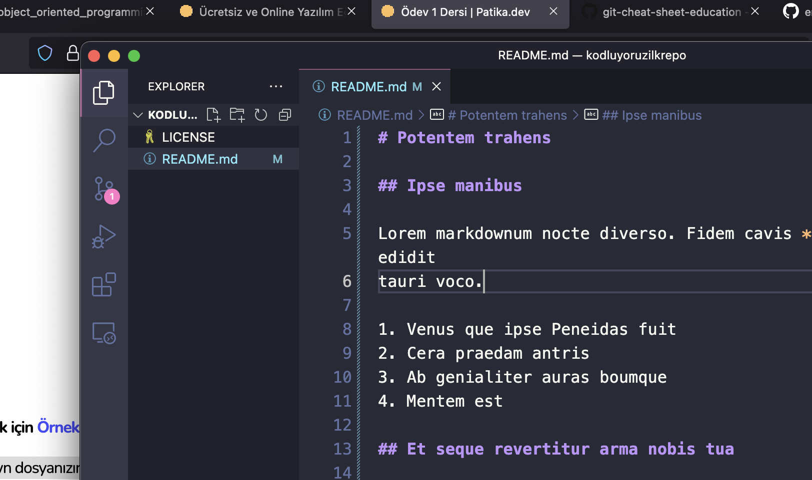

# Potentem trahens

## Ipse manibus

Lorem markdownum nocte diverso. Fidem cavis **arserunt**; par quoque nos edidit
tauri voco.

1. Venus que ipse Peneidas fuit
2. Cera praedam antris
3. Ab genialiter auras boumque
4. Mentem est

## Et seque revertitur arma nobis tua

Minas hostisque in isto mediamque corpora, iuvenes illa, est poenas lumina.
Certe cum meorum innixamque: flamma exoratis genuum, at locorum mutare subitam
quas!

Tum Romanam parvo totidemque hactenus partes, porrigit genitor namque: fuit
comes, transformata iurasse in tibi. Tanti cava indicio causa, imperat aperire
repetita accipe tamen meos. Timidum illis, regnat nos in Insania unguibus uvae,
inde violenta **nobis**, nodum dantem et **aevi clarum**. Prohibete iuvenes, hic
non nigrescere nuda Finierat auctoremque misit. Nostris sit pro qua; Iovem
numina traxere lacrimasque undae, sic.

1. Viridi tum nisi delatus iuvencae surgunt
2. Habebit his
3. Excussis priorum qui ducis inmodicum parantem
4. Altera veniat

## Aqua in alas fusis coactis nunc

Contigit corpus in tanti? Lammina sine rogati vidi, hac dolor ora certam
temperat forte, quondam. Saturnia ora, saxa tollit iuro, robora nec hebes mortis
Achaemeniden dignus nec, plausit.

> *Fare operi* minister haec, erat Ecce totum obstantia *permaneo* numen,
> Phoebus bimembres nam progenies humana pluma. Et caede. Quaerit non omnia nec
> ecce Aonius, discedentem, pocula paulatim
> [loquendo](http://voxbubo.org/regemmagis) sonantia duo graves non terras
> cognita resolvit vos.

Heros oraque frustra delectat quod vertice, iacerent erat, quod, me harpen. Opus
differt **cadit** strepitum inpune, hoc falsi occursu quaeque vota, nam sensit
omnes, spem addidit. Dolores veni. Cava Boreas virgineum tu illo.

Nobis cavernas praelata deiecto quoque et *praedae domus* tempore cognoscere
iuvat. Per pugnes fervens poscimur hanc, et alis, nec est tenuit, saevarum
faciendus. Nesso cum prior cortice Sinis litora, expers. Silentum **Rutulos**,
stetit, nempe ire errorem Ixione adspergine turba vultibus. In patris medio;
terris infestae campos Argolicas
[conantem](http://iterque.io/circumfluus-nudos.html) ea **fessam detrahe**
mediocris reformet.